<html>
<head>
    <h1>Deliveroo - Food Ordering System</h1>
</head>
<body>
<h2>What is this repository for?</h2>
<ul>
    <li>This repository is for Deliveroo android application.</li>
    <li>System Requiremnts: - Java 8 or higher, Android Studio</li>
    <li>Version 1.0</li>
</ul>
<h2>How do I get set up?</h2>
<ul>
    <li>Clone or Download the repository</li>
    <li>open the project using android studio</li>
    <li>Build and Run the project</li>
</ul>
<table style="width:100%">
    <tr>
        <th></th>
        <th>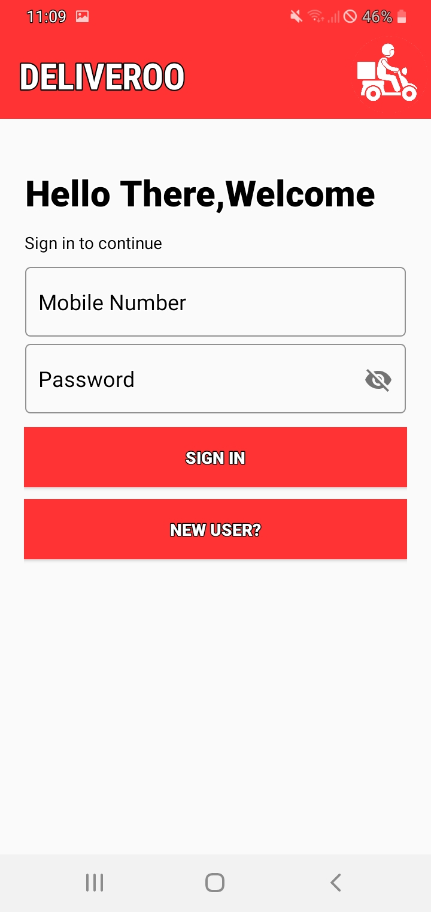</th>
        <th>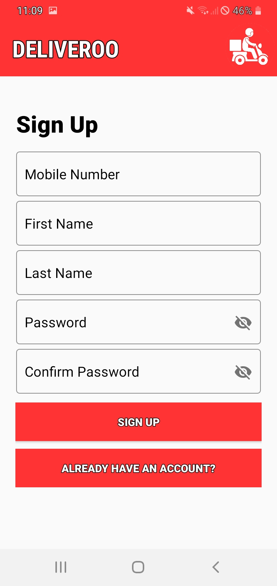</th>
        <th>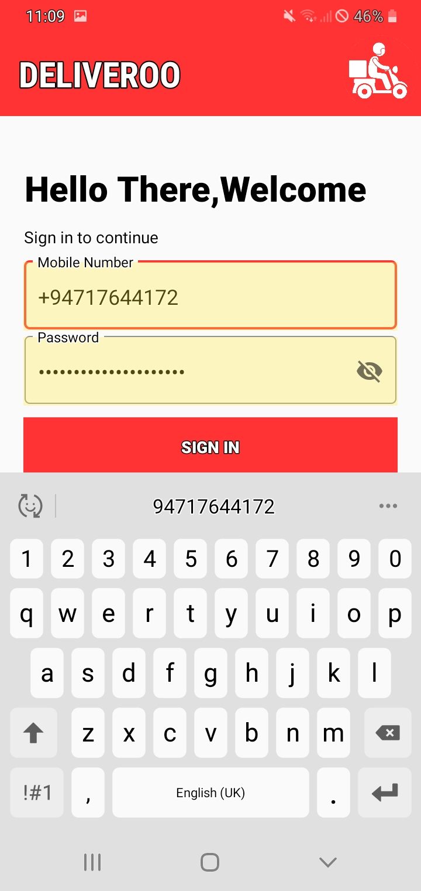</th>
    </tr>
    <tr>
        <th>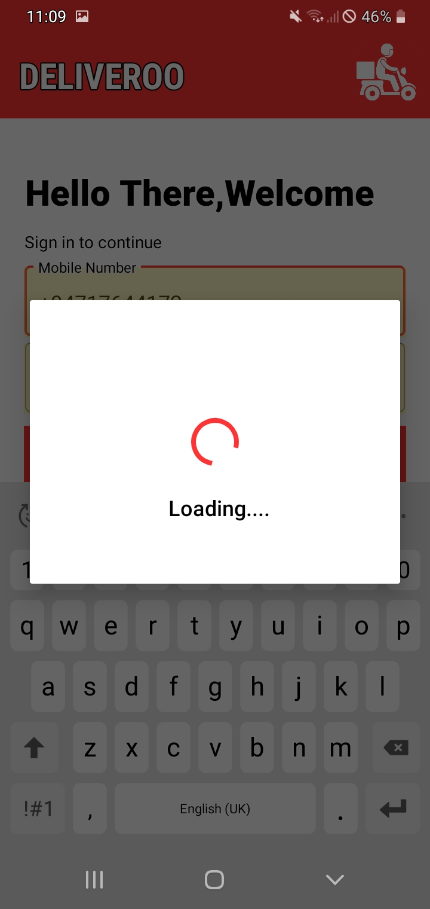</th>
        <th>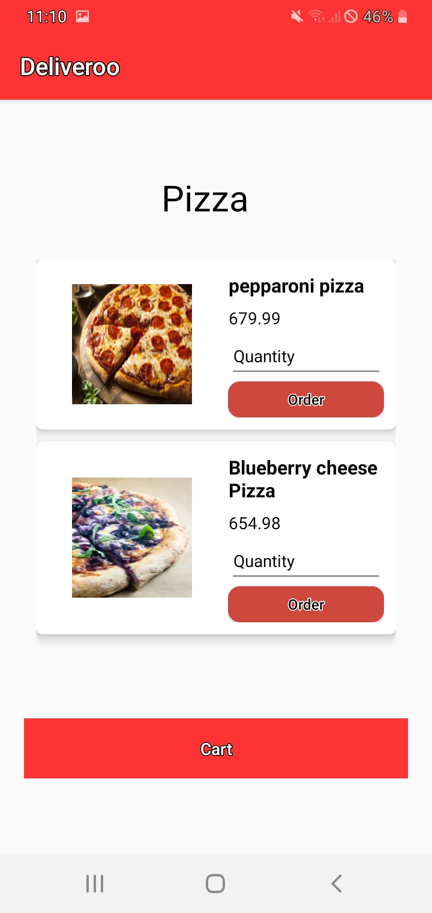</th>
        <th>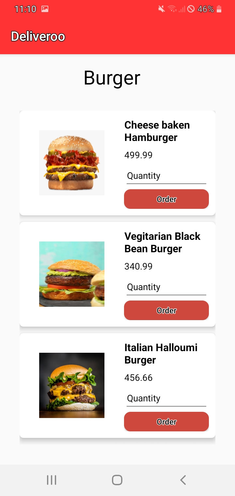</th>
        <th>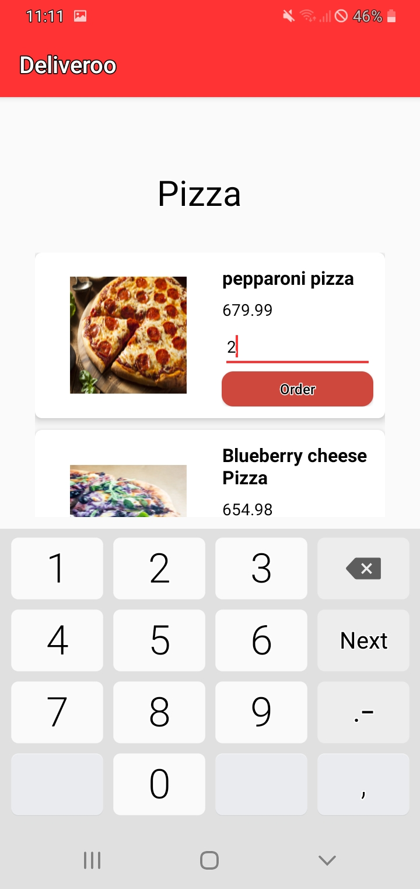</th>
    </tr>
    <tr>
        <th>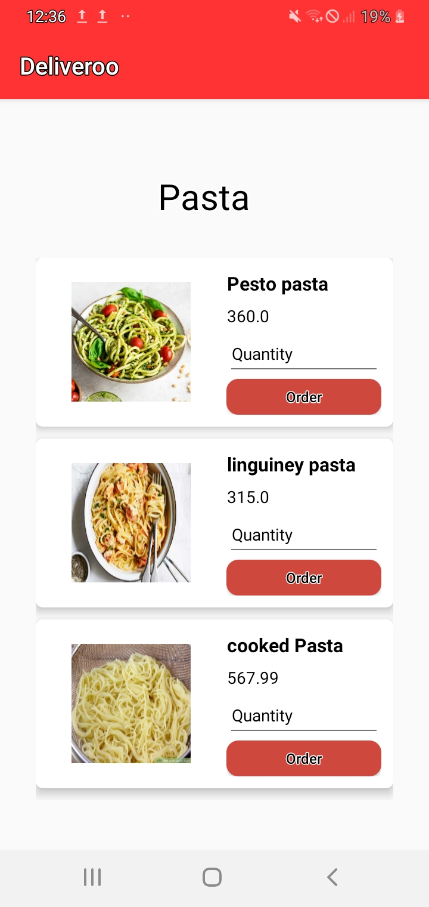</th>
        <th>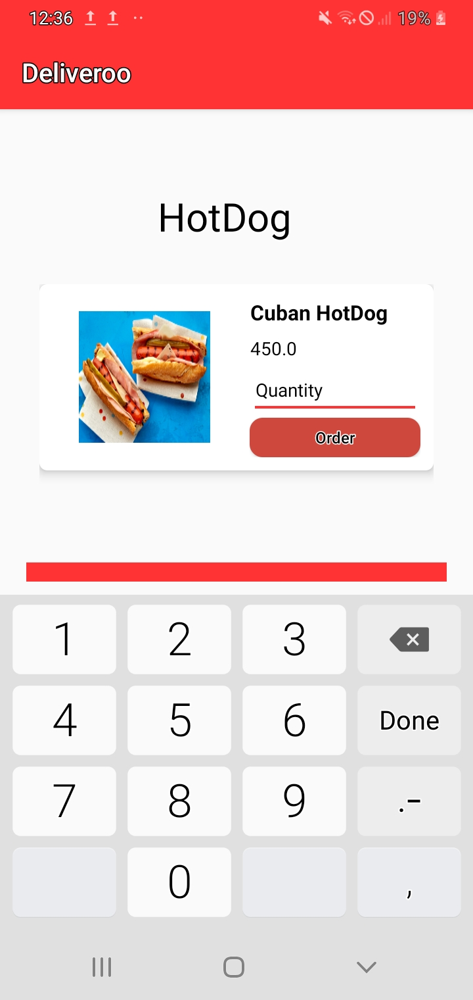</th>
        <th>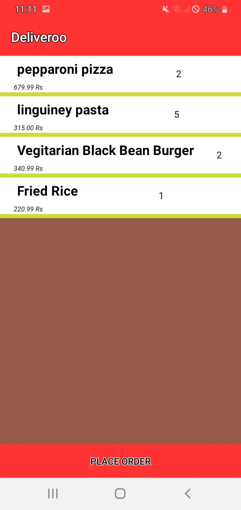</th>
        <th>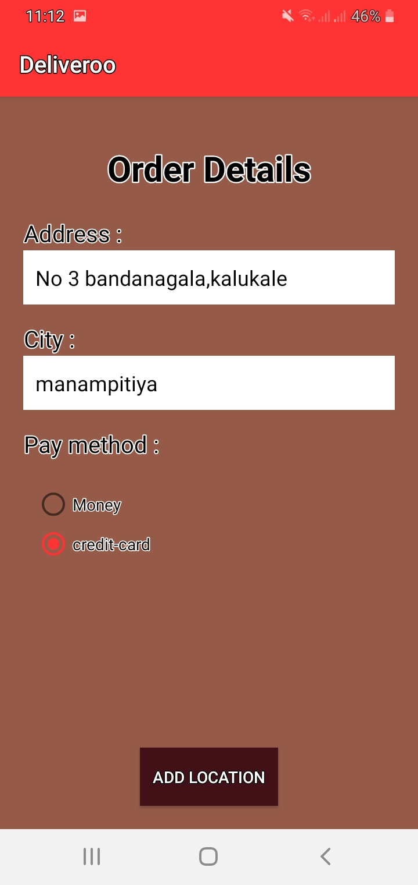</th>
    </tr>
    <tr>
        <th>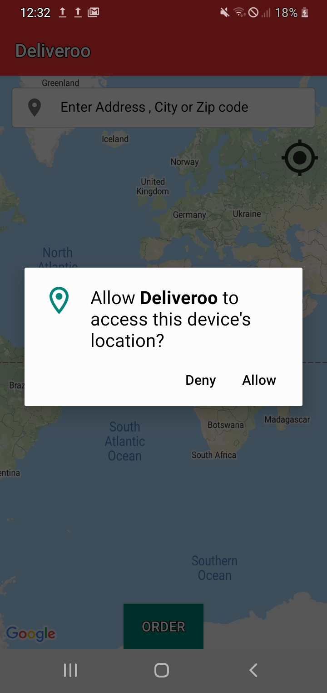</th>
        <th>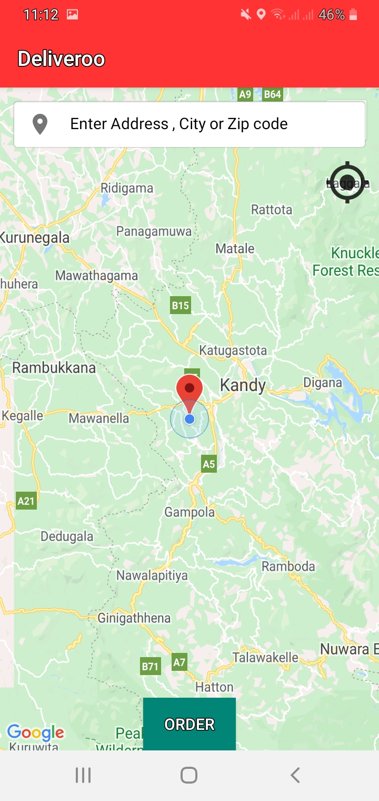</th>
        <th>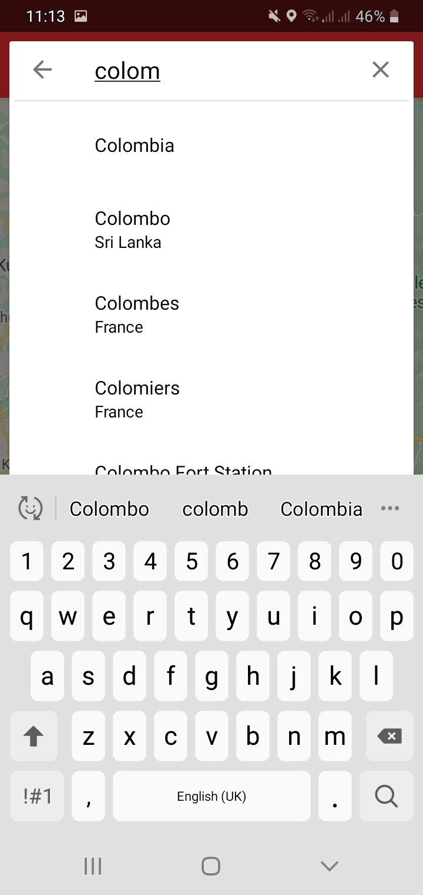</th>
        <th>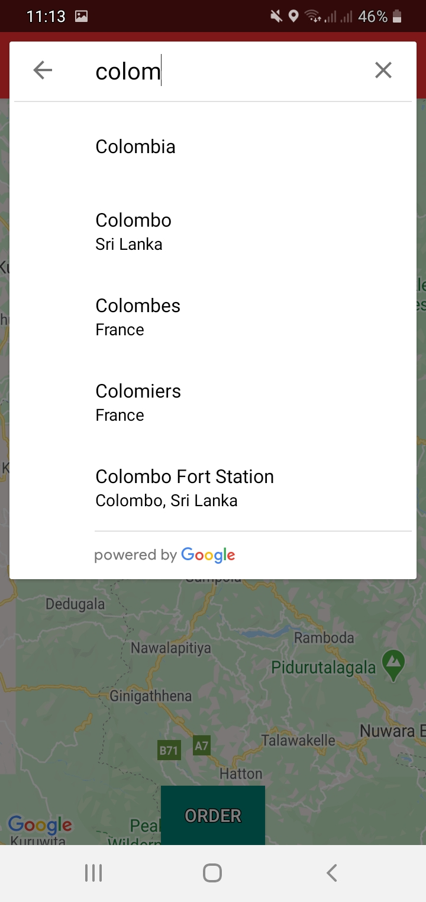</th>
    </tr>
    
</table>
<h2>Features</h2>

<h2>Tested Devices</h2>
<ul>
    <li>Samsung Galaxy M10 [os-Pie]</li>
    <li>Samsung Galaxy J5 [os-Marshmallow]</li>
     <li>Oppo A5 2020 [os-Oreo]</li>
</ul>

Apk file was added - <a href="https://github.com/NuwanHarsha/Deliveroo/tree/master/app-debug-apk">view APK</a> 

 
<h2>Contact Details</h2>
<ul>
    <li>Contributer: nuwan.harshamatrix@gmail.com</li>
    <li>Contributer: Erandanawijerathne96@gmail.com</li>
    <li>Contributer: sm201211d@gmail.com</li>
</ul>

</body>
</html>
